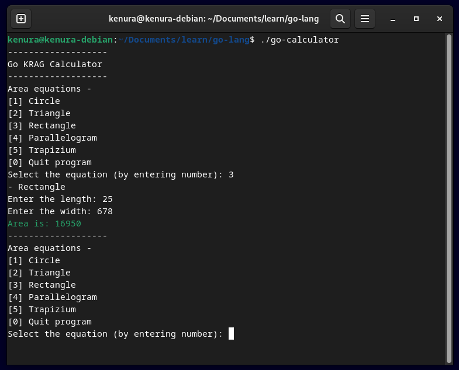

# Go Calculator

This is a simple command-line calculator written in Go. It supports various geometric shapes and calculates their areas based on user input.



## Features

- Calculate the area of a circle
- Calculate the area of a triangle
- Calculate the area of a rectangle
- Calculate the area of a parallelogram
- Calculate the area of a trapezium

## Prerequisites

- Go installed on your machine. You can download and install it from [here](https://golang.org/dl/).

## Usage

1. Clone this repository to your local machine:

   ```bash
   git clone https://github.com/Kenura-R-Gunarathna/go-calculator.git
   ```

2. Navigate to the project directory:

   ```bash
   cd go-calculator
   ```

3. Run the program:

   ```bash
   go run .
   ```

4. Follow the on-screen instructions to perform calculations.

## Contributing

Contributions are welcome! If you have any ideas for improvement or find any bugs, feel free to open an issue or submit a pull request.

## License

This project is licensed under the [MIT License](LICENSE).
